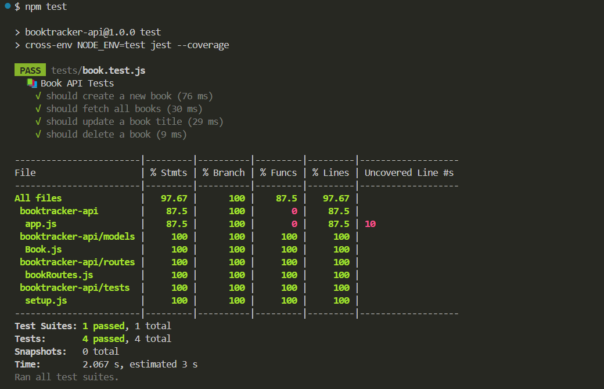

# BookTracker API

A simple CRUD API to track books using Node.js, Express, and MongoDB.

## API Endpoints

- `POST /api/books` - Add a new book
- `GET /api/books` - Get all books
- `PUT /api/books/:id` - Update a book
- `DELETE /api/books/:id` - Delete a book

## Testing

We used `Jest` and `Supertest` to test:
- Unit logic
- API endpoints
- Integration with the MongoDB database

### Test Coverage

- Statements: 97.67%
- Branches: 100%
- Functions: 87.5%
- Lines: 97.67%

## Tech Stack

- Node.js
- Express.js
- MongoDB with Mongoose
- Jest & Supertest
- `mongodb-memory-server` for in-memory testing

## Run Locally

1. Clone the repo  
   `git clone https://github.com/avrodotter/Bookbase`

2. Install dependencies  
   `npm install`

3. Run the server  
   `npm start`

4. Run tests  
   `npm test`

